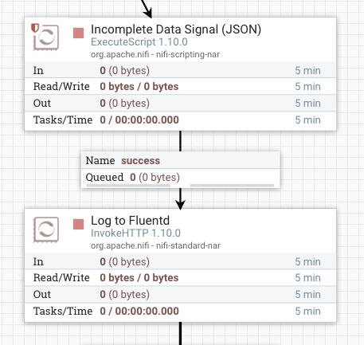
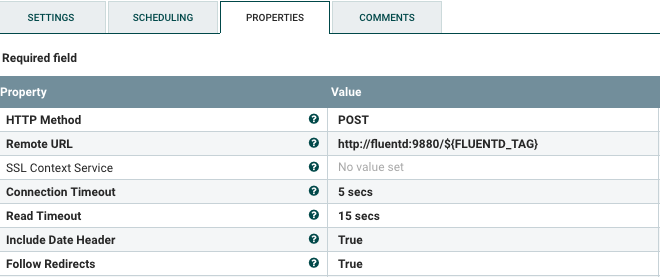
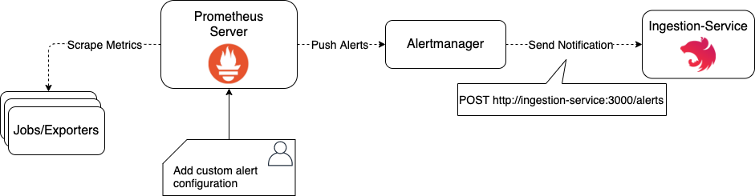
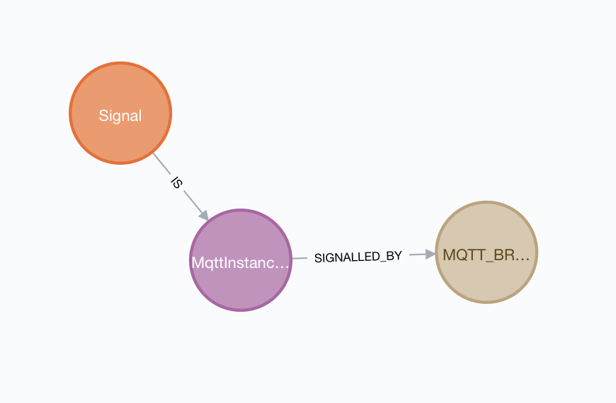
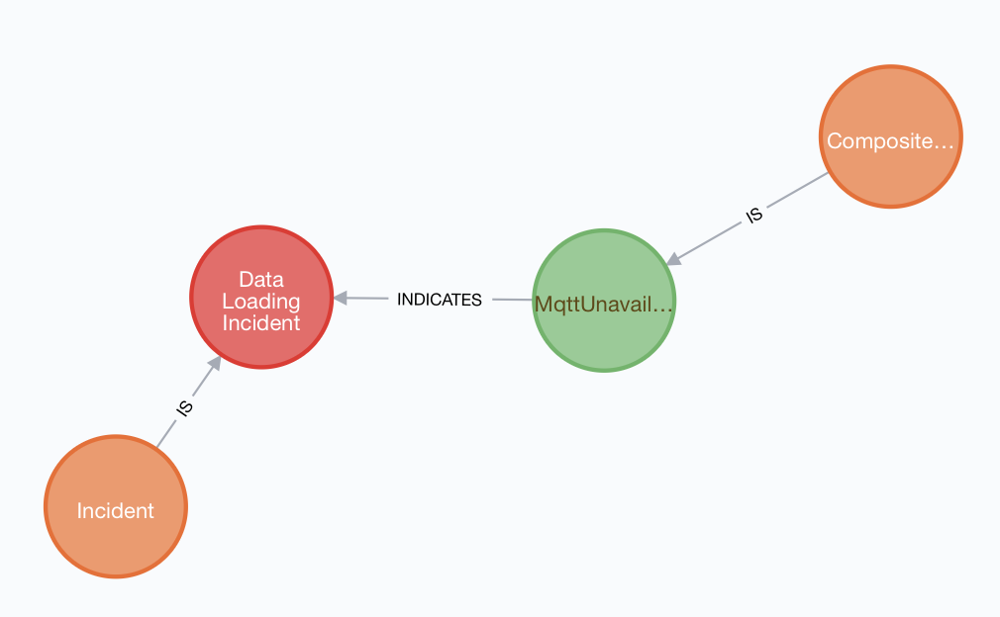
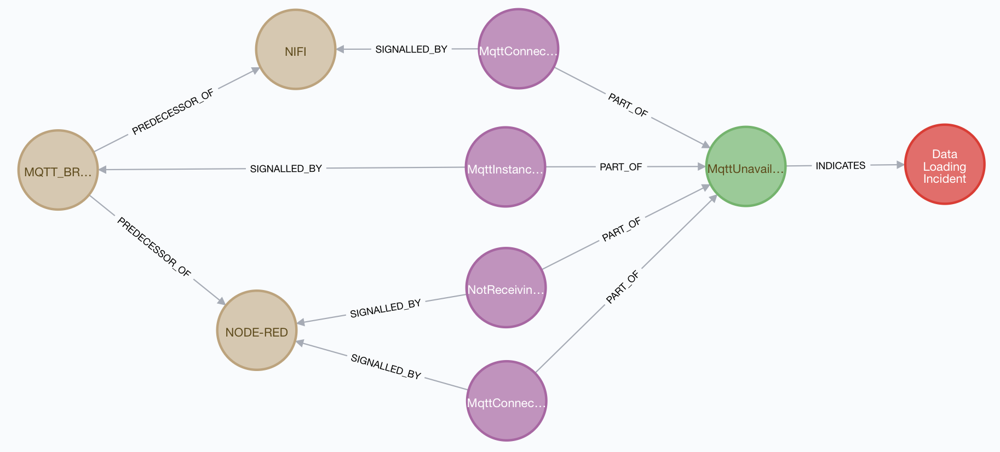
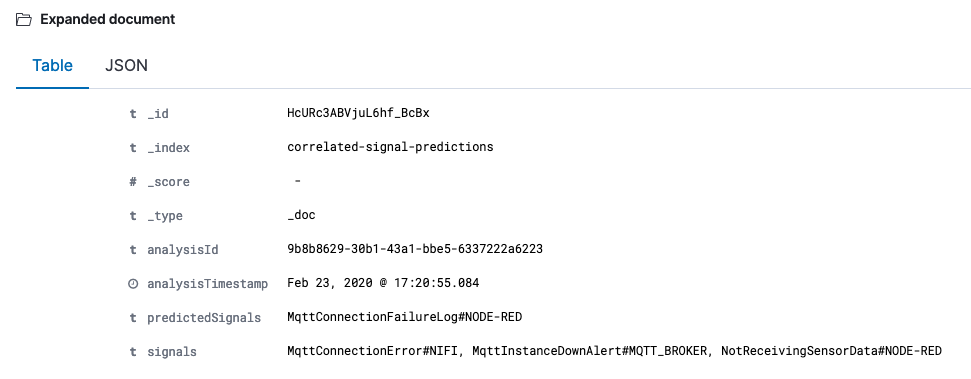
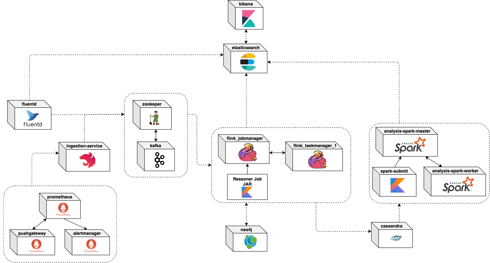

# Reasoning

This document describes the core ideas and components that can be used in order to reason about IoT incidents in Big Data applications.

[TOC]

- [High-Level Introduction](#high-level-introduction)
- [Reference Big Data Pipeline](#reference-big-data-pipeline)
  
  * [Sensors](#sensors)
    + [Dataset](#dataset)
  * [MQTT Broker](#mqtt-broker)
  * [Apache Flink](#apache-flink)
  * [Apache NiFi](#apache-nifi)
  * [Node-RED](#node-red)
  * [Apache Hadoop](#apache-hadoop)
  * [Apache Spark](#apache-spark)
  * [Elasticsearch and Kibana](#elasticsearch-and-kibana)
  * [Minimum Deployment View (Docker)](#minimum-deployment-view-docker)
- [Concepts and Terminology](#concepts-and-terminology)
  
  + [Importance of abstraction](#importance-of-abstraction)
  * [Pipeline Component](#pipeline-component)
  * [Signal](#signal)
  * [Composite Signal](#composite-signal)
- [Monitoring & Reasoning Pipeline](#monitoring--reasoning-pipeline)
  
  * [Simplified summary](#simplified-summary)
  * [Pipeline at a glance](#pipeline-at-a-glance)
    + [Note on modularity](#note-on-modularity)
  * [Structure of a Signal](#structure-of-a-signal)
    + [Example: Log-based Signal JSON](#example-log-based-signal-json)
    + [Example: Prometheus Alert-based Signal JSON](#example-prometheus-alert-based-signal-json)
  * [Log Collection: [Fluentd](https://www.fluentd.org/)](#log-collection-fluentd)
    + [How to collect logs](#how-to-collect-logs)
    + [The role of tags](#the-role-of-tags)
    + [How to capture log-based signals](#how-to-capture-log-based-signals)
    + [Summary of capturing](#summary-of-capturing)
    + [Where to forward logs](#where-to-forward-logs)
  * [Metric Collection and Alerting: [Prometheus](https://prometheus.io/)](#metric-collection-and-alerting-prometheus)
    + [How to bring data into Prometheus](#how-to-bring-data-into-prometheus)
    + [How to capture Signals with Prometheus](#how-to-capture-signals-with-prometheus)
    + [Example: From reporting to Signal](#example-from-reporting-to-signal)
  * [Prometheus -> Kafka Bridge: Ingestion-Service by [Nest.js](https://nestjs.com/)](#prometheus---kafka-bridge-ingestion-service-by-nestjs)
  * [Reliable Signal Collector: [Kafka](https://kafka.apache.org/) Pub/Sub](#reliable-signal-collector-kafka-pubsub)
  * [Scalable Signal Reasoning: [Flink](https://flink.apache.org/) Reasoner Job](#scalable-signal-reasoning-flink-reasoner-job)
    + [What the Reasoner does](#what-the-reasoner-does)
    + [Recurring Signals](#recurring-signals)
      - [Example](#example)
    + [CompositeSignal](#compositesignal)
      - [How does the Reasoner check time constraints?](#how-does-the-reasoner-check-time-constraints)
    + [Incident Reporting](#incident-reporting)
  * [Dynamic Incident and Signal Knowledge Graph: [Neo4j](https://neo4j.com/)](#dynamic-incident-and-signal-knowledge-graph-neo4j)
    + [Signal](#signal-1)
    + [CompositeSignals and Incidents](#compositesignals-and-incidents)
  * [Long-term Storage of Recorded Signals: [Cassandra](https://cassandra.apache.org/)](#long-term-storage-of-recorded-signals-cassandra)
  * [Frequent-Pattern Mining: [Spark](https://spark.apache.org/)](#frequent-pattern-mining-spark)
    + [Notes on implementation](#notes-on-implementation)
    + [Limitations, Area of Improvement](#limitations-area-of-improvement)
  * [Minimum Deployment View (Docker)](#minimum-deployment-view-docker-1)
- [Limitations](#limitations)
- [Potential Improvements](#potential-improvements)
  
    + [FP-Mining of Incidents](#fp-mining-of-incidents)
    + [Fluentd UI](#fluentd-ui)
    + [RDF Semantics + Neo4j](#rdf-semantics---neo4j)

## High-Level Introduction

Given an everyday Big Data pipeline responsible for ingesting, processing (both real-time and batch) and storing data of high volume, variety, velocity and veracity, so-called *incidents* (as defined in [TruongCompsac18](https://users.aalto.fi/~truongh4/publications/2018/truong-compsac2018-cr.pdf)) are inevitable. Individual incidents may happen on various abstraction layers such as physical (hardware issues), infrastructure (Cloud, VM issues), software (application platform and user application), and at the same time from the perspective of the data such as the lack of crucial information, high redundancy, inaccuracy, bad timeliness and many more. Obviously there are a lot of factors involved and usually individual incidents are connected to each other, either directly or indirectly in a cause-and-effect relationship. The bigger and more complex the pipeline gets, the ability to find the root-cause of incidents and to efficiently reason about them becomes exponentially more difficult.

In this document we provide a potential strategy with concrete tools and implementation for tackling this challenge. Goals include general applicability, extensibility, adaptability and scalability. Our proposed solution is based solely on open-source tools and focuses on the independence, modularity of specific tools s.t. these can be exchanged with others.

## Reference Big Data Pipeline

From now on *pipeline* refers to the examplery Big Data pipeline which requires monitoring and detection of incidents. The image below shows the structure of the pipeline and the flow of data.


Next, we will describe the function of each pipeline component. **Important note**: beware, that most of these components must be deployed in a cluster consisting of multiple containers. The image above does not reflect the deployment view, it is merely an abstraction.

### Sensors

The emission of sensor data is simulated by a simple Node.js application, which reads each row of a dataset and publishes it to the `customTopic` topic of the MQTT broker.

#### Dataset

The dataset is called *GNFUV Unmanned Surface Vehicles Sensor Data Set 2 Data Set* and is available for free on the [UCI Machine Learning Repository](https://archive.ics.uci.edu/ml/datasets/GNFUV+Unmanned+Surface+Vehicles+Sensor+Data+Set+2). The data-set contains eight (2x4) data-sets of mobile sensor readings data (humidity, temperature) corresponding to a swarm of four Unmanned Surface Vehicles (USVs) in a test-bed, Athens, Greece.

The datasets have been adjusted so that only the attributes *device_id*, *humidity*, *temperature*, *time* are included. The simulated sensor sends records in a configurable time interval. The following shows a sample JSON encoded record that gets published to the MQTT broker:

```yaml
{
"device_id": "gnfuv-temp-exp1-55d487b85b-5g2xh",
"humidity": "21",
"temperature": "40",
"time": "2020-02-18T21:23:32.106Z"
}
```

For more information about implementation details, configuration and deployment please refer to the [Sensors Readme](pipeline/sensors/README.md).

### MQTT Broker

The MQTT broker is realized by a single [Mosquitto](https://mosquitto.org/) instance. It acts as a gateway between the sensor data coming from the oustide world and the other analytics components.

For more detailed information about configuration, deployment please refer to the [MQTT Broker Readme](pipeline/mqtt/README.md).

### Apache Flink

The [Apache Flink](https://flink.apache.org/) component represents a common stream-processing aggregation scenario. It consumes the sensor data from the MQTT broker, keys the stream by the `device_id` attritbute and calculates the averages of `humidity` and `temperature` for every 10 records. The resulting calculation is finally sent to the Elasticsearch component and stored under the `flink-sensor-data` index.

A sample JSON-encoded aggregation produced by Flink looks the following:

```yaml
{
    "id": "94778233-4024-4962-b398-dc179f144457",
    "deviceId": "gnfuv-temp-exp1-55d487b85b-5g2xh",
    "numberOfMeasurements": 10,
    "averageHumidity": 22,
    "averageTemperature": 39.5,
    "measurementIds": [
      "2020-01-15T10:59:09.549Z",
      "2020-01-15T10:59:10.615Z",
      "2020-01-15T10:59:11.618Z",
      "2020-01-15T10:59:12.620Z",
      "2020-01-15T10:59:13.623Z",
      "2020-01-15T10:59:14.626Z",
      "2020-01-15T10:59:15.631Z",
      "2020-01-15T10:59:16.633Z",
      "2020-01-15T10:59:17.637Z",
      "2020-01-15T10:59:18.641Z"
    ]
}
```

Note: the original dataset doesn't contain unique IDs for each recording. Since a report like this is in the scope of a single device, the timestamp of the record can be used as `measurementId`(more precisely, the pair of `deviceId` and `time` is always unique).

For more information about implementation details, configuration and deployment please refer to the [Flink Readme](pipeline/flink/README.md).

### Apache NiFi

The [Apache Nifi](https://nifi.apache.org/) component has the responsibility to simply consume the sensor records from the MQTT broker and storing them in a remote HDFS (= the Hadoop component). There is an already pre-built [NiFi Template](pipeline/nifi/IoT_Sensor_Data_Storage_Template.xml) in XML-format, which can be imported in the web-UI. The template containes the extended version showcasing how application-level signals can be emitted.

For more information about implementation details, configuration and deployment please refer to the [NiFi Readme](pipeline/nifi/README.md).

### Node-RED

The [Node-RED](https://nodered.org/) component represents a Node.js-based event-driven data pipeline. The provided *Flow* for our scenario simply consumes the sensor records from the MQTT broker and writes them to its local filesystem. The purpose of this component is to have technological heterogeneity with regard to platforms and programming languages. 

### Apache Hadoop

As introduced earlier, the Hadoop cluster merely acts as a storage component in our scenario. The sensor data collected in a HDFS is later leveraged by Spark to perform data analysis.

For more information about configuration and deployment please refer to the [Hadoop Readme](pipeline/hadoop/README.md).

### Apache Spark

The [Apache Spark](https://spark.apache.org/) component represents a large-scale data analytics use-case. The application reads sensor records from the remote HDFS and performs a Kmeans clustering on them based on the `humidity` and `temperature` attributes. The results are simply printed out. Again, for the purposes of heterogeneity, the application code is written in Python.

For more information about implementation details, configuration and deployment please refer to the [Spark Readme](pipeline/spark/README.md).

### Elasticsearch and Kibana

Apart from their usual responsibilities, these two components are present in order to close the Big Data analytics circle. [Elasticsearch](https://www.elastic.co/elasticsearch) is used to store Flink's generated reports and, as we will see later, logs and important events. [Kibana](https://www.elastic.co/kibana) is the visualizing component of the Delivery phase.

### Minimum Deployment View (Docker)

The [docker-compose.yml](docker-compose.yml) file contains all the definitions of services/containers that are required in order to run the reference pipeline. Only the Elasticsearch and Kibana services are not defined in this file, because they are also part of the monitoring pipeline (their definitions can be found in  [docker-compose.monitoring.yml](docker-compose.monitoring.yml). Please note that some of the services are meant to be scaled horizontally. Below  a diagram is shown, containing the minimum amount of containers.


## Concepts and Terminology

This section defines a set of terms that are relevant in the context of monitoring. 

#### Importance of abstraction

Monitoring of today's distributed systems involves a lot of complexity. In practice, no two systems are equal and given two companies the requirements usually differ greatly. As a consequence there is no silver bullet or an off-the-shelf solution suitable for all systems. This is especially true for Big Data applications. In order to avoid chaos and gain observability into these applications, it is important to keep up a certain level of abstraction. 

When it comes to the reasoning about which set of event(s) led to a certain outcome, it doesn't play a crucial role, whether the system or parts of the system are self-hosted or deployed in the Cloud, as long as we are able to gather the relevant information about a certain symptom leading to an incident. Consider the following example: the Flink component indicates that there are no records coming from the MQTT Broker. This is an actual symptom that we ought to be made aware of, because the constant processing of sensor data is crucial for meeting SLAs and SLOs. The cause, in our case the MQTT broker not delivering data, can potentially be one of myriad issues. From the reasoning perspective, it doesn't necessarily matter how the broker has been deployed. Maybe the broker instance has been restarted; maybe there is a temporary network outage; maybe the Cloud environment does its job at being elastic and redistributes the load. The important thing here is the ability to capture the issue at Flink and clearly pointing the cause to the MQTT broker. 

### Pipeline Component

As you will see, the term *pipeline component* gets used a lot in the monitoring/reasoning parts. In order to maintain abstraction, this term refers to a component which is part of the whole Big Data pipeline and has a clear function. For example, in the very first diagram Flink is a pipeline component, while the user-defined job, the jobmanager and task managers are simply parts of that component. 

### Signal

During monitoring of Big Data pipelines, we need to deal with a great amount of log data, metrics, traces, all in different formats, shapes and semantics. In order to cut through the noise and abstract away any potential (future) ways of expressing monitoring data, we introduce the notion of a *Signal*. 

As defined in the book [Introductory Signal Processing](https://books.google.at/books?id=QBT7nP7zTLgC&pg=PA1&redir_esc=y#v=onepage&q&f=false), a signal "*is a function that conveys information about a phenomenon.*" In this context, a signal can be any sort of data, message that expresses an important event used later for incident reasoning. As we will see later, in the scope of this project there are 3 ways to generate signals, all of them in a JSON format:

* marking of infrastrucure/platform logs as signals
* emitting user-written signals from the application level
* construct Prometheus alerts on any level which will be interpreted as signals

The Monitoring & Reasoning Pipeline section goes into more detail how a Signal should look like.

### Composite Signal

A Compsite Signal is the same as a simple Signal as far as its intentions are concerned. The difference is however, that a Composite Signal is composed of one or more Signals. This concept makes it easily possible to combine arbitrary Signals which indicate incidents.

## Monitoring & Reasoning Pipeline

This section describes the proposed monitoring solution in detail including the selection of tools and required instrumentation steps.

### Simplified summary

Ignoring the specific chosen tools, the whole process can be summarized into the following steps:

* centralize telemetry data as best as possible
  * structured logs: infrastructure, platform, user-application
  * metrics in a time-series format
* annotate, mark any telemetry data that are signalling important events, incidents so that these are handled as *Signals* instead of *noise* 
* the Reasoner processes each Signal one by one in real-time; with the help of the underlying Knowledge Graph it determines whether the Signal is fired, and whether it indicates any incidents
  * if an incident gets activated, a report is generated and sent to the visualizing component
  * additionally, each Signal's occurrence is recorded for future analysis
* perform on-demand Frequent-Pattern Mining on the historical Signal records, discover correlated Signals and provide recommendations for combining multiple Signals into CompositeSignals
* maintain the Knowledge Graph by adding new CompositeSignals and indicated incidents

### Pipeline at a glance

The image below illustrates the monitoring/reasoning pipeline. In the following, we will describe each component's purpose and requirements in detail.


#### Note on modularity

While the pipeline may seem unreasonably fragmented, this is not a side effect. As stated earlier, an important goal is to uphold a high degree of independence when it comes to tooling, because most companies already have some sort of monitoring procedures in place. With this architecture and minimal requirements, it should be fairly easy to swap out specific tools with preferred ones fulfilling the same purposes. In each component's description below, we will provide a reason for picking the tool as well as other alternatives.

### Structure of a Signal

As already introduced, a Signal is any event that is marked or emitted as important to capture. These Signals are later processed by a Flink-based job, therefore there are some necessary bits of information assumed for each one. Currently, 2 types of JSON-formatted Signals are supported: 

* Signals represented as logs: any log collected centrally by Fluentd marked as Signal
* Signals represented as Prometheus alerts: any defined Prometheus alert

 Whether the incoming Signal is parsed from a log or a Prometheus alert depends on the top-level attribute `signalType: "<SIGNAL_TYPE>"` which can be either `LOG` or `PROMETHEUS_ALERT`.

#### Example: Log-based Signal JSON

The absolute *minimum* required fields are shown below. Please note the decider property `signal_type` at the beginning:

```json
{
  "signal_type": "LOG",
  "tag": "signal.MqttConnectionError",
  "pipeline_component": "NIFI",
  "event_time": "2020-02-21T21:30:09.791000000Z",
  "message": "ConsumeMQTT[id=74042ed4-c995-3baa-744b-fab0653c5533] Connection to tcp://mqtt:1883 lost (or was never connected) and connection failed. Yielding processor: MqttException (0) - java.net.UnknownHostException: mqtt"
}
```

The above JSON is just an excerpt of a typical Signal log. Since logs can have many more arbitrary fields and objects, there are no restrictions on them. Additional properties are parsed as a `details: [object]` property, which holds a key-value map of all the additional fields and values.

#### Example: Prometheus Alert-based Signal JSON

Similarly to the log-based example, the JSON below shows an excerpt of a common Prometheus alert representing the required attributes.

```json
{
  "signal_type": "PROMETHEUS_ALERT",
  "labels": {
    "alertname": "NotReceivingSensorData",
    "pipeline_component": "NODE-RED"
  },
  "annotations": {
    "summary": "Instance nodered:1881 is not receiving sensor data"
  },
  "startsAt": "2020-02-20T18:53:41.18011468Z"
}
```

The complete alert object may look like this:

```json
{
  "signal_type": "PROMETHEUS_ALERT",
  "status": "firing",
	"labels": {
    "alertname": "NotReceivingSensorData",
    "pipeline_component": "NODE-RED",
    "instance": "nodered:1881",
    "job": "node-red",
    "severity": "critical"
  },
  "annotations": {
    "summary": "Instance nodered:1881 is not receiving sensor data",
    "description": "nodered:1881 of job node-red has not been receiving any sensor data from the MQTT broker for the last 30 seconds."
  },
  "startsAt": "2020-02-20T18:53:41.18011468Z",
  "endsAt": "0001-01-01T00:00:00Z",
  "generatorURL": "http://ad459e008c77:9090/graph?g0.expr=increase%28mqtt_received_data_packets_total%7Bjob%3D%22node-red%22%7D%5B30s%5D%29+%3D%3D+0&g0.tab=1"
}
```

Every additional, arbitrary, non-required key-value pairs inside `labels` and `annotations` are dynamically collected for later reporting.

Please refer to the [official Prometheus documentation](https://prometheus.io/docs/alerting/configuration/#webhook_config) and to the section about the ingestion-service for more information about the structure of Prometheus alerts.

If you're interested in how a Signal is represented in the Knowledge Graph and in the Reasoner component, please head over to the respective section.

### Log Collection: [Fluentd](https://www.fluentd.org/)

 

**Goal**: centralize logs of each participating component and of each layer in a structured, JSON-format.

**Why** Fluentd: it is free, open-source and part of the [Cloud Native Computing Foundation](https://www.cncf.io/projects/) (CNCF) with a graduated status. It has extensive lists of plugins for both input and output sources, and can be easily customized.

**Alternative(s)**: Logstash, Splunk, DataDog, Greylog

#### How to collect logs

How log data gets into Fluentd very much depends on the amount of control one has over the target component:

* **No control**, only a Docker container or rolling log files: we make the assumption that we either have access to the Docker container or the output log files of the target component. In the latter case, the small sibling of Fluentd, called [Fluent Bit](http://fluentbit.org/) is recommended to be deployed as a sidecar container which tails the log file of the component and forwards the logs to the central Fluentd instance. Alternatively, for any given Docker container it is possible set a remote Fluentd instance as the log driver ([official documentation](https://docs.docker.com/config/containers/logging/fluentd/)). In the prototype [docker-compose.yml](docker-compose.yml) the definition looks like this:

  ```yaml
  logging:
    driver: fluentd
    options:
      fluentd-address: localhost:24224
      tag: com.rdsea.sensor.{{.ID}}.platform
      fluentd-sub-second-precision: "true"
  ```

  The `tag` is an essential part of the log collection in Fluentd, because further processing, filtering of records are based on the parts of a tag.

* **Control over the platform**, e.g. Flink, NiFi, Node-RED: for many languages and tools, it is possible to integrate a dependency that will take care of forwarding the logs to Fluentd. For example, in case of tools which support the configuration of a `logback.xml` file, an external JAR dependency called [Fluency](https://github.com/komamitsu/fluency) should be packaged along. In the Logback configuration, the additional appender can be specified as shown below. For more details, please refer to the respective components' README:

  ```xml
  <appender name="FLUENCY_SYNC" class="ch.qos.logback.more.appenders.FluencyLogbackAppender">
    <!-- The tag each log record will get. Here, the tag value is externalized as an environment variable. -->
    <tag>${LOG_COMPONENT_TAG}</tag>
  
    <!-- Host name/address and port number which Flentd placed -->
    <remoteHost>fluentd</remoteHost>
    <port>24224</port>
  
     <!-- [Optional] Additional fields(Pairs of key: value) -->
     <!--<additionalField>
     <key>key</key>
     <value>value</value>
     </additionalField>-->
  
     <flushIntervalMillis>1200</flushIntervalMillis>
     <useEventTime>true</useEventTime>
     <sslEnabled>false</sslEnabled>
     <flattenMapMarker>false</flattenMapMarker>
  
     <encoder>
          <pattern>%d{yyyy-MM-dd HH:mm:ss.SSS} [%thread] %-5level %logger{60} %X{sourceThread} - %msg%n</pattern>
     </encoder>
  </appender>
  ```

  For NPM-based applications, such as Node-RED there is a [fluent-logger](https://www.npmjs.com/package/fluent-logger) NPM package which can be leveraged to output any platform logs to a remote Fluentd instance.

* **Control over the user-application level**: depending on the specific application there may be some limitations, but for the majority of the cases it is recommended to use one of the Fluentd SDKs. There are libraries available for all major programming languages. Please refer to the pipeline components on how to use the libraries.

#### The role of tags

Upon careful inspection of Fluentd it can be observed that tagging of logs is an essential component of it. Every incoming event in Fluentd needs to have a `tag` property. It is this attritbute that one needs to rely on when defining `filter` and `match` directives (see [configruation](logging/fluentd/conf/fluent.conf) for concrete examples). 

Moreover, **the value of an event's tag decides whether it is handled as a Signal or not**. In other words, the `tag` property is the way to *annotate* log-based events and mark them as signals. The format is defined as follows:

`tag: "**.signal.<SIGNAL_NAME>"`

The tag can contain any other parts (separated by dots) up to `signal`. The part **after** `signal` stands for the name of the signal. The name part is crucial, because a Signal is uniquely identified by its name and the pipeline component it belongs to. Valid examples:

* `tag: "signal.MqttStartupLog"`
* `tag: "com.rdsea.mqtt.signal.MqttStartupLog"`
* `tag: "com.rdsea.flink.app.signal.RedundantData"`

Additionally, `tag` should contain the name of the pipeline component it is emitted from (e.g. mqtt, flink, nifi) and also an indication of the layer (e.g. platform, app). These are required for filtering and setting properties automatically within Fluentd. To illustrate this, the following is an excerpt from the monitoring pipeline's Fluentd configuration:

```
# This filter gets activated for every record that contains "nodered" somewhere in the tag property
<filter **.nodered.**>
  @type record_modifier
  <record>
    # For each matched record we add the "pipeline_component" key with "NODE-RED" as value
    pipeline_component NODE-RED
  </record>
</filter>
```

#### How to capture log-based signals 

If the application-layer can be controlled/updated, then the recommended way is to integrate the Fluentd SDK and emit the desired events with it. Furthermore, we encourage to utilize a consistent way of reporting signals from this layer, adhering the [CloudEvents](https://github.com/cloudevents/spec) specification. This part is optional as long as the signals are properly JSON-formatted, consistent across components and have a `tag` property required by Fluentd. We recommend CloudEvents (please refer to the [specification](https://github.com/cloudevents/spec/blob/v1.0/spec.md)) as it is vendor-neutral and its structure promotes flexibility. Example event:

```json
{
    "specversion" : "1.0",
    "type" : "com.github.pull.create",
    "source" : "https://github.com/cloudevents/spec/pull",
    "subject" : "123",
    "id" : "A234-1234-1234",
    "time" : "2018-04-05T17:31:00Z",
    "comexampleextension1" : "value",
    "comexampleothervalue" : 5,
    "datacontenttype" : "text/xml",
    "data" : "<much wow=\"xml\"/>"
}
```

This may seem too much at first, however only the fields `id`, `source`, `specversion` and `type` are mandatory. The rest (and potentially more) is up to the individual requirements.

Since such `CloudEvents` are essentially JSON objects, one can simply build them manually. At the same time there are [SDKs](https://github.com/cloudevents/spec#sdks) for several programming languages so that the writing of such objects are made easier.

As an illustration, in the Node-RED component it would be possible to signal the missing time information of sensor data that otherwise would be critical using a `function` node:

```javascript
const FluentLogger = context.global.get('FluentLogger'); // Flutentd SDK
const EventTime = FluentLogger.EventTime;
const Cloudevent = context.global.get('Cloudevent'); // CloudEvent SDK (optional)
const uuidv4 = context.global.get('uuidv4');

if(!msg.payload.hasOwnProperty('time')) {
    let date = new Date();
  
    let event = Cloudevent
    .event()
    .type("com.rdsea.nodered.mqtt.app.signal.MissingTimeInformation")
    .source(`Node-Red/Sensor-Data-Flow/nodes/${node.name}-${node.id}`)
    .id(uuidv4())
    .time(date) 
    .data(msg.payload) // you may append the data if necessary
    .subject(`${msg.payload.device_id}`)
    .addExtension("message",'Sensor data is missing time information!');

    // the first parameter tells FluentLogger what to use as `tag`
    FluentLogger.emit('mqtt.app.signal.MissingTimeInformation', event.spec.payload, EventTime.fromDate(date));
    return null; // return null, thus halting the flow
} 

// perform additional checks depending on the use-case
// whenever we encounter an issue, the function should automatically return null,
// i.e. not propagating the (faulty) payload.

return msg;
```

There are situations where it is infeasible to use a library to push logs to Fluentd. For these cases Flutentd can be configured to accept JSON records via HTTP, essentially enabling components to simply post their logs via a conventional HTTP call:

```
# Makes Fluentd accept records at port 9880
<source>
  @type http
  port 9880
  bind 0.0.0.0
  cors_allow_origins ["*"]
  <parse>
    @type json
    time_key time
    keep_time_key true
    time_type string
    time_format %Y-%m-%dT%H:%M:%S.%NZ
  </parse>
</source>
```

For example, in Apache NiFi it would require substantial effort to integrate the Fluentd SDK. As a workaround, user-level signals can be pushed to Fluentd through the described HTTP channel. The following shows the contents of an `ExecuteScript` Processor (with `Script Engine` set to `Groovy`) that generates and forwards a JSON string:

```groovy
import groovy.json.JsonSlurper
import groovy.json.JsonBuilder
import groovy.json.JsonOutput

import java.time.ZonedDateTime
import java.time.format.DateTimeFormatter

def ff = session.get()
if(!ff)return
ff = session.write(ff, {rawIn, rawOut->
    rawIn.withReader("UTF-8"){reader->
        rawOut.withWriter("UTF-8"){writer->
            def slurper = new JsonSlurper() as Object
            def mqttPayload = slurper.parse(reader)
            def cloudEvent = JsonOutput.toJson([
                    specversion: '0.3',
                    id: UUID.randomUUID().toString(),
                    type: "com.rdsea.nifi.mqtt.app.signal.IncompleteSensorData",
                    source: "NiFi Flow/processor/ConsumeMQTT",
                    time: ZonedDateTime.now()
                            .format(DateTimeFormatter.ofPattern("yyyy-MM-dd'T'HH:mm:ss.SSS'Z'")),
                    subject: "${mqttPayload.device_id}-${mqttPayload.time}",
                    message: "Sensor record is incomplete!"
            ])
            def resultJson = slurper.parseText(cloudEvent)
            new JsonBuilder(resultJson).writeTo(writer)
        }
    }
} as StreamCallback)
ff = session.putAttribute(ff, "FLUENTD_TAG", "com.rdsea.nifi.mqtt.app.signal.IncompleteSensorData")
session.transfer(ff, REL_SUCCESS)
```

Please note the line second to last. The value of `FLUENTD_TAG` is stored as a session attribute in the resulting `FlowFile`. This value is subsequently used in an `InvokeHTTP` Processor. For a better understanding, the image below shows how these two Processors are set up in NiFi.



For completeness, here is how the `InvokeHTTP` Processor is configured:

<p align="center">
  
</p>

Note the usage of the attribute `FLUENTD_TAG`. What this node does is making an HTTP POST request to the remote URL with the JSON content we built in the processor before.

Up to this point we've covered how application-layer, log-based Signals can be captured. There may be however complex incidents that require the capture of logs which are emitted by the infrastructure or the platform and therefore cannot be altered. For this task, pattern-based matching is required. In Fluentd's configuration a so-called `rewrite_tag_filter` plugin can be leveraged. As an example, suppose that we would like to mark the connection failure to the MQTT Broker in NiFi as a Signal. This can be achieved with the following configuration:

```
<match **.nifi.platform**>
  @type rewrite_tag_filter
  <rule>
    key message
    pattern /^ConsumeMQTT\[.*\] Connection to tcp:\/\/[^\s]+ lost .*$/
    tag signal.MqttConnectionError
   </rule>
  <rule>
    key message
    pattern /^.+$/
    tag noise
  </rule>
</match>
```

What this directive does: it matches only records for which the `tag` contains nifi.platform. If set up correctly, these should only match platform logs coming from NiFi components. Then, the directive looks at the `message` property and if the value matches the regex pattern defined in `pattern` than it replaces the tag with `signal.MqttConnectionError`. Otherwise, the tag gets rewritten to `noise`.

#### Summary of capturing

In order to make this subsection round, here is a short summary of the 3 main ways how log-based Signals can be captured:

* Any layer with control:
  * use of Fluentd SDK (optionally including CloudEvents specifcation)
  * use of conventional HTTP-POST logging to Fluentd's HTTP endpoint
* Any layer without control, only access to logs as-is:
  * use of regex pattern matching within Fluentd to mark certain logs as Signals

#### Where to forward logs

There is a wide selection of output plugins, so that targets can be tailored to requirements. In our monitoring pipeline, as illustrated in the architecture image, logs are separated into two subsets, *Signal*s and *Noise*s. Every log that receives the annotation `signal` in its tag is interpreted as a *Signal* and therefore will be broadcast to the Kafka component's `signals` topic. The rest of the logs are pushed to Elasticsearch, where DevOps and stakeholders can further use/visualize the data for other purposes.

### Metric Collection and Alerting: [Prometheus](https://prometheus.io/)


**Goal**: provide a consistent way to build Signals based on time-series data

**Why** Prometheus: it is free, open-source and part of the [Cloud Native Computing Foundation](https://www.cncf.io/projects/) (CNCF) with a graduated status. It has huge community and commercial support.

**Alternative(s)**: InfluxDB (TICK stack), OpenTSDB, Nagios, Sensu

Before going into the details, it is advisable to make oneself familiar with Prometheus' architecture. The following diagram has been taken over from the official [documentation](https://prometheus.io/docs/introduction/overview/#architecture).


With regard to monitoring, there are a few key things that should be kept in mind:

* Prometheus is *meant to be* pull-based
  * it requires targets that can be *scraped* for metrics
  * there is a `Pushgateway` component supporting the push-based metrics, however these should be utilized sparingly. Pushgateway is mean to be used for ephemeral, short-lived batch jobs.

For the scope of this project, we make the assumption that defined alerts in Prometheus for which the Alertmanager creates notifications are meant to be Signals.

#### How to bring data into Prometheus

Similar to the case with logging, different strategies exist depending on the degree of control over the target component. These include:

* **Exporter-based**:
  * Due to Prometheus' popularity, there are so-called exporters for a wide range of applications, including those for Big Data. Exporters are essentially jobs/programs that connect to their targeted application and provide the application's metrics in the right format for Prometheus to scrape. For example, Mosquitto (MQTT Broker in the pipeline) has an [available exporter](https://github.com/sapcc/mosquitto-exporter). The same applies for Hadoop's [resource manager or namenode](https://github.com/wyukawa/hadoop_exporter) and [Elasticsearch](https://github.com/justwatchcom/elasticsearch_exporter). Unfortunately, not every platform/engine has a corresponding available exporter implementation. For instance, at the time of writing, Apache Spark only supports the provision of JVM-metrics with a Graphite sink. A possible workaround involves setting up a [Graphite exporter](https://github.com/prometheus/graphite_exporter) - a server which accepts metrics (in this case from Spark) in Graphite protocol and provisions them as Prometheus metrics. In contrast, Apache Flink [natively supports](https://ci.apache.org/projects/flink/flink-docs-stable/monitoring/metrics.html#prometheus-orgapacheflinkmetricsprometheusprometheusreporter) the reporting of internal metrics in Prometheus format - all required is an extra JAR file and a flag.
  * **Advantage of exporter**: exporters offer time-series data on metrics that are specific to the monitored application. If we're only interested in low-level metrics such as RAM usage or the general JVM metrics, then an explicit exporter might be unnecessary. On the other hand, Flink's exporter provides more fine-grained metrics about the JobManager, TaskManagers, operators and much more which are specific to Flink. Another example is Mosquitto. Without an already written exporter, it would require additional manual effort to tap into Mosquitto's internals in order to get the metrics. The existing exporter already offers a great set of metrics that we can leverage.  
* **Application-based**:
  * Specific, custom-written metrics need to be exposed on the application-layer. For this the recommended way is to use one of the existing [client libraries](https://prometheus.io/docs/instrumenting/clientlibs/). 
  * In custom Flink code, it's very easy to [register metrics](https://ci.apache.org/projects/flink/flink-docs-stable/monitoring/metrics.html#registering-metrics) due to its support for Prometheus.
* Last resort: **cAdvisor**
  * Assuming that the previous two strategies cannot be applied due to limitations, a deamon called [cAdvisor](https://github.com/google/cadvisor) provides a fallback for getting resource usage and performance metrics of running Docker containers.
  * If there is absolutely no way to instrument a crucial component or expose its metrics, then the recommended decision is to avoid investing excessive effort into that component and rely on the reporting of other ones. To illustrate this, let us assume that there is a third-party data source from where our pipeline is receiving its crucial data from. If the monitoring at the source is infeasible, then it should be performed at the entry point of our pipeline, namely the first component(s) the external data arrives at (which can be instrumented).

#### How to capture Signals with Prometheus

As mentioned earlier, the notion of Signals in case of metrics are based on alerts that need to be defined inside Prometheus. The diagram below shows the participating components and how metrics can become Signals.




Assuming that the scrape targets are configured, capturing a Signal requires the following steps:

* Define alerts inside Prometheus (see its [README](monitoring/prometheus/README.md) for configuration details) based on the desired metrics. These may include infrastructure, platform, application metrics or even a combination thereof.  [PromQL](https://prometheus.io/docs/prometheus/latest/querying/basics/), Prometheus' built-in querying language is required to define alert expressions over one or more time-series.
  * Make sure to include `pipeline_component` as label in the alert.
  * Alerts can be added/updated/removed during runtime. One needs to invoke Prometheus' `reload` action which triggers the reload of the configuration files.
* Whenever the expression in the defined alert matches in Prometheus, it pushes the alert to the Alertmanager component. In the configuration of the Alertmanager, a new route and a new receiver of type `webhook` must be defined. Please refer to [alertmanager.yml](monitoring/prometheus/alertmanager.yml) configuration.
  * If you already have alerting in place with e-mail, Slack etc. as receivers and therefore don't want every alert to forwarded as Signal, then simply introduce a distinction label for the Signal alerts and make the `ingestion-service` route only match alerts that have that particular label.

#### Example: From reporting to Signal

In order to provide a clearer picture, we illustrate the the last sub-sections based on an example. In the reference Big Data pipeline, let us assume that we want to track the number of sensor data records the Node-RED component processes. As we will see later, this can help us indicate a data loading incident. These are the steps that need to be reproduced:

* **Instrumentation**: since our desired metric is use-case driven, we cannot leverage existing performance-based metrics (one could argue that the number of received bytes could be a reasonable indication, but this is not the point here) and therefore need to provide a custom, user-written one. In the Node-RED flow, after consuming the sensor data record, a `function` node must be added with the following Javascript content, utilizing the [Prom-client](https://github.com/siimon/prom-client) library:

  ```javascript
  const prometheus = context.global.get('prometheus');
  let counter;
  if ( typeof context.global.get('sensorDataCounter') == 'undefined' || !context.global.get('sensorDataCounter') ){
      counter = new prometheus.Counter({
          name: 'mqtt_received_data_packets_total',
          help: 'The total number of consumed sensor data packets from the MQTT broker.'
      });
      context.global.set('sensorDataCounter',counter);
  } else {
      counter = context.global.get('sensorDataCounter');
  }
  counter.inc();
  return msg;
  ```

  We define a Prometheus metrics of type `Counter` (i.e. value, that is positive and strongly monotonic) with the name `mqtt_received_data_packets_total`. Every time the flow reaches this node, we retrieve the current counter object from the execution context (or create a new one if it doesn't exist) and increment its value. The underlying library takes care of exposing this metric to Prometheus.

* **Alert configuration**: now that we have the metrics in Prometheus, is is also required to alert on the situation where Node-RED doesn't receive sensor data. One way to create a Signal on this is to monitor the increase of the counter over time. If the value of the counter doesn't change for a specific amount of time, then this means that there hasn't been any processed sensor record. In Prometheus, we need to define this alert in YAML format. The following is an excerpt from [nodered.yml](monitoring/prometheus/rules/nodered.yml):

  ```yaml
  - alert: NotReceivingSensorData
    expr: increase(mqtt_received_data_packets_total{job="node-red"}[30s]) == 0
    labels:
      severity: critical
      pipeline_component: NODE-RED
    annotations:
      summary: "Instance {{ $labels.instance }} is not receiving sensor data"
      description: "{{ $labels.instance }} of job {{ $labels.job }} has not been receiving any sensor data from the MQTT broker for the last 30 seconds."
  ```

  Explanation: `NotReceivingSensorData` is the name of the alert and **thus the name of our Signal** as well. The value of `expr` is the PromQL expression, controlling whether the alert gets fired ot not. In this example, if the increase of our counter doesn't change in a 30 seconds time-window, then this alert gets activated. The `labels` and `annotations` arrays are user-specified key-values.

  **Important: when defining alerts as Signals, always include the `pipeline_component` label**. This is required so that the Reasoner at a later stage can associate the Signal with the correct component.

If the Alertmanager is configured correctly and the above alert gets activated by Prometheus, then the Alertmanager forwards it to the Ingestion-Service via a POST HTTP request. The Ingestion-Service is described next.

### Prometheus -> Kafka Bridge: Ingestion-Service by [Nest.js](https://nestjs.com/)


**Goal**: provide a low-overhead solution for bringing Prometheus alerts to an Apache Kafka cluster.

**Why** Nest.js: framework that facilitates the creation of fast, scalable, lightweight, Node.js based backend applications. Supports [Fastify](https://www.fastify.io/), a low-cost and efficient web framework.

**Alternative(s)**: any high-performance server-side web framework, that is capable of emitting events to a Kafka cluster.

This component simply accepts JSON-formatted alerts coming from the Alertmanager ([official alert format](https://prometheus.io/docs/alerting/configuration/#webhook_config)), appends the `"signal_type": "PROMETHEUS_ALERT"` key-value pair to the alert and emits them to the Kafka cluster described in the following section.

Continuing the alerting example from above, if the `NotReceivingSensorData` alert gets triggered in Prometheus, the following JSON will be ingested to Kafka:

```json
{
   "signal_type": "PROMETHEUS_ALERT",
   "status": "firing",
   "labels": {
      "alertname": "NotReceivingSensorData",
      "instance": "nodered:1881",
      "job": "node-red",
      "pipeline_component": "NODE-RED",
      "severity": "critical"
   },
   "annotations": {
      "description": "nodered:1881 of job node-red has not been receiving any sensor data from the MQTT broker for the last 30 seconds.",
      "summary": "Instance nodered:1881 is not receiving sensor data"
   },
   "startsAt": "2020-02-21T22:02:04.339Z",
   "endsAt": "0001-01-01T00:00:00Z",
   "generatorURL": "http://ad459e008c77:9090/graph?g0.expr=increase%28mqtt_received_data_packets_total%7Bjob%3D%22node-red%22%7D%5B30s%5D%29+%3D%3D+0&g0.tab=1"
}
```

**Important: This entire component may not be required depending on the alerting mechanism/tool. For example, in case of the TICK stack based on InfluxDB, the Kapacitor component natively supports sending alerts to a Kafka cluster via [Kafka event handler](https://docs.influxdata.com/kapacitor/v1.5/event_handlers/kafka). If an alternative tool to Prometheus is used, please make sure that the alerts are either formatted like in the above example OR extend the Reasoner component by a new Signal parser.**

### Reliable Signal Collector: [Kafka](https://kafka.apache.org/) Pub/Sub


**Goal**: provide a way to reliable collect Signals in real-time with consistent ordering and data retention

**Why** Apache Kafka: it is free, open-source and battle-tested solution; can handle high throughput and is easily scalable if required

**Alternative(s)**: RabbitMQ, Google Cloud Pub/Sub, Amazon Kinesis, ActiveMQ and more

This component simply acts as a middleware between all the sources of Signals and the components that are interested in processing those Signals (in our case the Reasoner). Apart from performance reasons, the usage of such a middleware serves the purpose of decoupling the sources and the targets from each other. In other words, with this setup it is straightforward to introduce new ways of gathering Signals and also processing them. If desired, multiple parallel jobs/programs can consume the Signals from the middleware and process them the way they want.

### Scalable Signal Reasoning: [Flink](https://flink.apache.org/) Reasoner Job


**Goal**: process Signals

**Why** Apache Flink: within the extent of the current Reasoner, the utilization of a stream-processing framework is not absolutely necessary; however with increased amounts of Signals and rules, having the implementation in Flink enables the horizontal scalability at ease. Furthermore it has native support for [Complex Event Processing](https://ci.apache.org/projects/flink/flink-docs-release-1.10/dev/libs/cep.html) and even [Graph analysis](https://ci.apache.org/projects/flink/flink-docs-release-1.10/dev/libs/gelly/).

**Alternative(s)**: for low to moderate load any agent capable of consuming Kafka records, maintaining connections to Neo4j and Cassandra is enoug. For high load, stream processing engines are recommended such as Apache Flink, Apache Spark, Apache Storm, Kafka Streams and more.

#### What the Reasoner does

In short, the Reasoner job consumes each Signal from the Kafka cluster and processes it while interacting with three separate databases: the Knowledge Graph (Neo4j), Recording of Signals (Cassandra) and Incident Reports (Elasticsearch).

Before going into the details about Signals, CompositeSignals and Incidents, the following describes the main steps/decisions the reasoner executes upon consuming a valid Signal instance:

1. Match the Signal with the Knowledge Graph
   * if the Signal is not in the database yet, store it and associate it with the correct component
2. Record the occurrence of this Signal in Cassandra
3. Check if Signal is really activated - please refer to [Recurring Signals](#recurring-signals) for more.
4. Collect all the CompositeSignals that this Signal is part of
5. Determine the CompositeSignals that have been activated by this Signal
6. For all activated CompositeSignals (if any), determine the incidents they indicate
7. Create Incident Reports for any determined, indicated incident and store them in Elasticsearch.

#### Recurring Signals

There are situations in which a certain event indicates an issue, but only if it occurrs more than once within a defined time-window. Normally, these cases could be solved by either depending on time-series-based alerts or by writing custom logic that only emits the event, the *Signal* if the given conditions are met. However, there may be cases where the last two solutions are infeasible, e.g. due to lack of control. If all we have are repeating logs, then we need a way to collect a set of them before actually firing a Signal. This is why, internally in the scope of the Reasoner and the Knowledge Graph, a Signal implicitly supports the behavior of being a thresholded, recurring one. It does so by offering two optional properties:

* `threshold`: an integer value > 0, denoting the minimum number of occurrences required to interpret this Signal as truly activated
* `coolDownSec`: an integer value > 0, specifying the number of seconds until two consecutive occurrences of the same Signal are associated with each other. In other words, `coolDownSec` defines a maximum duration between two occurrences to cause a `thresholdCounter` to be incremented.

##### Example

Based on the reference pipeline, suppose we want to create a Signal in the NiFi component if there is some issue with the MQTT connection. We observe that upon conncetion problems, the NiFi platform starts to spam log errors indicating the issue. Simply capturing the mentioned log as a conventional Signal would be unwise, because network fluctuations may happen and this would result in so-called false-positives. To be able to make the distinction between sudden, temporary non-issues and actual connection problems is required. For this, we can capture the log event as described in the [How to capture log-based signals](#how-to-capture-log-based signals) section and make use of the additionally supported properties by setting `threshold` to e.g. 10 and `coolDownSec` to e.g. 15. This would cause the Reasoner not to consider this Signal *activated* as long as the `thresholdCounter` doesn't reach the value of `threshold` (in this case 10). However, should the time difference between two consecutive instances of that Signal be greater than `coolDownSec` (in this case 15 seconds), then the counter is reset, thus substantially reducing the false-positive rate of activated Signals.

In order to make use of this feature, for the time being these properties need to be manually set via the Neo4j Browser.

#### CompositeSignal

At the beginning of this document, the concept of CompositeSignals has been briefly introduced. It plays an important role in the Reasoner component as well as in the Knowledge Graph. A CompositeSignal can be described by the following characteristics:

* it is made up of at least one Signal; it semantically binds several Signals together
* its activation is directly associated with Incidents.

Given a defined Incident, e.g. *IncompleteDataIncident*, and a Signal, then a CompositeSignal is the node that connects them together. It is the conceptual bridge between (multiple) Signal(s) and Incident(s).

The idea behind CompositeSignals is two-fold: 

* in the context of Big Data, it is assumed that analytics incidents are not trivially attributed to one single event, but rather to a set of events;
* an event, in this case a Signal, can lead to several, unforeseeable Incidents, i.e. it is not tied to a single Incident

With a CompositeSignal as a sort of middleman between Incidents and Signals, as a result it is possible to dynamically adjust which Signals indicate a particular Incident (add/remove relationships) and also to make a new association between an already existing Signal and Incident.

In the current version, CompositeSignals, Incidents as well as the relationships between them need to be manually added through pre-defined queries. Please refer to the next section about Neo4j for the concrete queries. Furthermore, a valid CompositeSignal has two properties:

* `activationThreshold`: a double-precision value between 0.0 and 1.0 indicating the percentage of activated, connected Signals required for this CompositeSignal to be also activated
  * if not set, the default value is 1.0 (= 100%), i.e. all of the connected Signals need to be active for this CompositeSignal to fire
* `coolDownSec`: similar to a Signal's case, this is an integer value > 0, specifying the time-window in which the determined required number of Signals need to be active
  * if not set, the default value is 60, i.e. 60 seconds

The `activationThreshold` property offers a way to associate a lot of individual Signals with a single CompositeSignal while not requiring all of them to be active in order to cause an Incident report.

##### How does the Reasoner check time constraints?

The Knowledge Graph keeps track of the `lastSignalTime` for each Signal as well as of the `activationTime` between a Signal and corresponding CompositeSignal(s) respectively. This makes it possible to optimize queries and make temporal-based decisions.

#### Incident Reporting

In case that all the conditions for the firing of a CompositeSignal are met, i.e. the minimum number of required activate Signals within the time-window is fulfilled, the Reasoner queries all the Incidents the CompositeSignal is connected to. For each of these Incidents, a JSON-formatted report is generated containing the name of the Incident, time of occurrence, name of the CompositeSignal, a summary and all the individual Signals (including their arbitrary details such as log message, stack trace, alert description, ...). This report is then sent to Elasticsearch so that DevOps can visualize it in Kibana. The diagram below shows a sample report in Kibana in a collapsed state.


If you're intereted in the whole JSON document that is sent to Elasticsearch, please refer to the [Sample_Incident_Report.json](reasoning/flink-reasoner/Sample_Incident_Report.json) file.

### Dynamic Incident and Signal Knowledge Graph: [Neo4j](https://neo4j.com/)


**Goal**: have an efficient way to represent the relationships between domain nodes and to traverse through them

**Why** Neo4j: it's the database technology that previous works (classification of incidents) were built-upon; it is currently the most popular graph database with matured plugins, a very user-friendly query language and drivers for the most common languages.

**Alternative(s)**: there are a couple of open-source graph databases such as [JanusGraph](https://janusgraph.org/), [OrientDB](https://orientdb.org/) and more commercial ones

In this section we will describe how Signals, CompositeSignals, Incidents and relationships between them can be created/modified. Most examples are taken from the Neo4j Browser.

#### Signal

As described in the previous section, a Signal node is automatically created by the Reasoner job if it is not found in the database.

**Example**: Let's say the operator of the MQTT broker set up a Prometheus alert named `MqttInstanceDownAlert`. Upon the activation of this alert, the Signal gets through to the Reasoner and will be persisted into the Knowledge Graph as shown below.



*Note*: some relationships and nodes are omitted on purpose.

However, if you wish to make this Signal a specialized one with multiple occurrences, the two required properties need to be set with a query. The following Cypher query first looks for the Signal node we wish to update and sets the `threshold` and `coolDownSec` properties to 5 and 30 respectively.

```cypher
MATCH (s:Signal {name:'MqttInstanceDownAlert'})-[:SIGNALLED_BY]->(c:DataPipeline {name:'MQTT_BROKER'})
SET s.threshold=5
SET s.coolDownSec=30
```

#### CompositeSignals and Incidents

Currently, CompositeSignal and Incident nodes need to be created manually but it is easy to do so. It is possible to create them one by one, however in the example below we show how a CompositeSignal named `MqttUnavailable` and an Incident named `Data Loading Incident` can be created and connected with each other.

```cypher
MATCH (e:Element {name:'Incident'})
MATCH (cs:Element {name:'CompositeSignal'})
CREATE (compSig:CompositeSignal {name:'MqttUnavailable'}) // creates the CompositeSignal
CREATE (i:Incident {name:'Data Loading Incident'}) // the Incident
CREATE (e)-[:IS]->(i), (cs)-[:IS]->(compSig),(compSig)-[:INDICATES]->(i) // here we connect the nodes via relationships
SET compSig.activationThreshold=0.5 // optionally set the activationThreshold of the CompositeSignal
SET compSig.coolDownSec=30; // optionally set the coolDownSec of the CompositeSignal
```

This query results in the following nodes and relationships:



Following the same strategy, we can connect multiple individual Signal nodes with a CompositeSignal one via the `PART_OF` relationship. The below diagram shows a full example, containing 4 Signals being part of the `MqttUnavailable` CompositeSignal.



Keep in mind that a single Signal node is not limited to one CompositeSignal. It can be part of any other CompositeSignal as well at the same time. Conversely, if the CompositeSignal needs tweaking, we can add, remove connections to Signals, add other Incidents indicated by this CompositeSignal or even update the activation threshold during runtime. The file [UsefulQueries.cypher](reasoning/neo4j/UsefulQueries.cypher) contains several Cypher queries for this context.

### Long-term Storage of Recorded Signals: [Cassandra](https://cassandra.apache.org/)


**Goal**: store each occurrence of a Signal in a database suitable for analytics later

**Why** Cassandra: it is a tried and tested database in analytics scenarios; features scalability, high availability, decentralization while maintaining performance; Also a contributing factor to the decision was that Cassandra is supported by both Flink and Spark.

**Alternative(s)**: for low volume of data, it is also possible to get away with solutions like [MongoDB](https://www.mongodb.com/), however databases like [CouchDB](https://couchdb.apache.org/), [HBase](https://hbase.apache.org/), [Accumulo](https://accumulo.apache.org/) and Cassandra are optimized for huge datasets. A good comparison can be found [here](https://kkovacs.eu/cassandra-vs-mongodb-vs-couchdb-vs-redis).

As mentioned in multiple sections, during monitoring we leverage Cassandra to store a continuous log of Signal events. The table `signals` has a simple schema:

```
uuid uuid, 
timestamp timestamp, 
signal_name text, 
pipeline_component text
```

The following lines show a couple concrete examples from Cassandra:

```
uuid                                 | pipeline_component | signal_name            | timestamp
--------------------------------------+--------------------+------------------------+--------------------------
e7adcdc3-6b7f-455f-bdbc-d05b11d4542a |           NODE-RED | NotReceivingSensorData | 2020-02-20 20:48:21+0000
7a98b848-1c4a-42a4-b671-65fa7de30a75 |               NIFI |    MqttConnectionError | 2020-02-20 22:10:33+0000
```

For more information on how to set up Cassandra, please refer to its [README](reasoning/cassandra/README.md).

### Frequent-Pattern Mining: [Spark](https://spark.apache.org/)


The purpose of this component is to make use of the data stored in Cassandra by discovering potential causal relationships between Signals. The implementation is based on the paper [Fast Dimensional Analysis for Root Cause Investigation in a Large-Scale Service Environment](https://arxiv.org/pdf/1911.01225.pdf) published by Facebook engineers in November, 2019.

Frequent-Pattern Mining is a technique of [Association Rule Learning](https://en.wikipedia.org/wiki/Association_rule_learning) with the intention of finding association rules in large-scale transaction data. In our context, the steps can be described as follows:

* each recorded Signal is a transaction
* assign each Signal to a time-window 
* the set of Signals for a given time-window can be seen as the item-set
* perform FP-Mining on the item-sets, i.e. find Signals which *frequently* occur together

The idea behind this analytics is that Signals which are somehow related are likely to happen within each other's temporal window; and the more frequent these Signals occur in the same constellation the higher the confidence. This makes it possible to present potentially undiscovered associations between Signals to DevOps and operators, who in turn can update the Knowledge Graph by connecting the Signals by relationships.

The implementation is an Apache Spark task written in Kotlin. It reads all the records from the Cassandra `signals` table, transforms the data to be suitable for FP-mining, performs the mining, filters out unnecessary/redundant predictions and finally stores them into Elasticsearch to be visualized in Kibana. The diagram below illustrates how a prediction is stored and displayed in Kibana.



The document predicts that whenever `MqttConnectionError` by NiFi, `MqttInstanceDownAlert` by MQTT Broker and `NotReceivingSensorData` by Node-RED Signals happen, then also the `MqttConnectionFailureLog` by Node-RED will happen. This correlation is obvious in our case, since these signals are set up to alert on a potential Data Loading Incident, but it is a sanity-check at the same time.

#### Notes on implementation

There are 4 main parameters that influence the analysis:

* `minSupport`: the minimum support for an itemset to be identified as frequent. For example, if an item appears 3 out of 5 transactions, it has a support of 3/5=0.6. 
  * default is 0.1, but can be overwritten by the `APP_FP_MIN_SUPPORT` environment variable
* `minConfidence`: minimum confidence for generating Association Rule. Confidence is an indication of how often an association rule has been found to be true. For example, if in the transactions itemset `X` appears 4 times, `X` and `Y` co-occur only 2 times, the confidence for the rule `X => Y` is then 2/4 = 0.5. 
  * default is 0.5, but can be overwritten by the `APP_FP_MIN_CONFIDENCE` environment variable
* `window_duration`: the length of a time-window, e.g. "15 seconds" or "1 minute" etc. For example "1 minute" causes the algorithm to create time-windows for every minute.
  * default is "1 minute", but can be overwritten by the `APP_WINDOW_DURATION` environment variable
* `slide_duration`: the amount of time to slide each time-window; for example if `window_duration`="1 minute" and `slide_duration`="15 seconds" this means that the algorithm will create 1 minute long time-windows for each 15 seconds of a minute
  * default is "0 second", but can be overwritten by the `APP_SLIDE_DURATION` environment variable

#### Limitations, Area of Improvement

Although several steps are included in order to only report on meaningful predictions, currently the results are not checked against the Knowledge Graph. This means that the algorithm, at its current state, also discovers and suggests already established, trivial correlations. In the future this could be avoided by including an extra step in the analysis which checks whether the predicted Signal sets are already combined by a common CompositeSignal.

### Minimum Deployment View (Docker)

The [docker-compose.monitoring.yml](docker-compose.monitoring.yml) and [docker-compose.metrics.yml](docker-compose.metrics.yml) files contain all the service definitions required for running the monitoring pipeline. To save on the number of components, the Flink JobManager as well as the TaskManager are re-used from the reference pipeline. The diagram below shows the deployment view of the monitoring pipeline with Docker-compose and minimum scalability.



## Limitations

CompositeSignals and incidents need to be manually added to the Knowledge Graph, currently using the Neo4j Browser. Although thanks to the Cypher language this is not a difficult task, there should be some kind of interface with better usability which also hides Neo4j as the used database. 

The synchronization of clocks and handling of time-zones is out of scope of this project. For every component UTC timestamps are assumed. Furthermore, Signals in the reasoner are processed in the order they arrive. We rely on Kafka's correct ordering. 

## Potential Improvements

#### FP-Mining of Incidents

Frequent Pattern Mining could be applied to incidents as well. The idea is that every inferred incident should be recorded (just like the Signals at the moment) and find correlating, not yet connected incidents through FP-mining. Example: if, let's say, in 100% of the time *Incident_B* happens after some time of *Incident_A*, then it may be likely that these two are not just correlated, but also reveal causation.

#### Fluentd UI

[Fluentd UI](https://docs.fluentd.org/deployment/fluentd-ui) offers the capability to manage running Fluentd instances through the web browser. Since a good chunk of annotations have to be carried out in the configuration files, Fluentd UI would make this task much more convenient. Unfortunately it showed some issues in testing, therefore this remains as a future improvement for the time being.

#### RDF Semantics + Neo4j

There has been rudimentary experiments with RDF-based semantics and Neo4j by [Neo4j Labs](https://github.com/neo4j-labs/neosemantics). Approaches like this could be investigated to improve the inferencing part of the monitoring.

