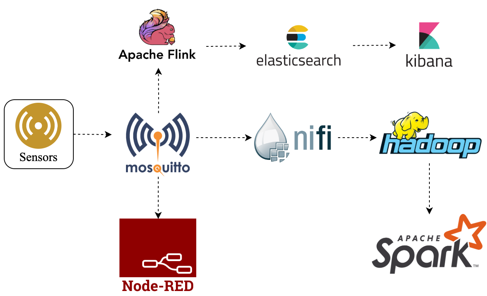
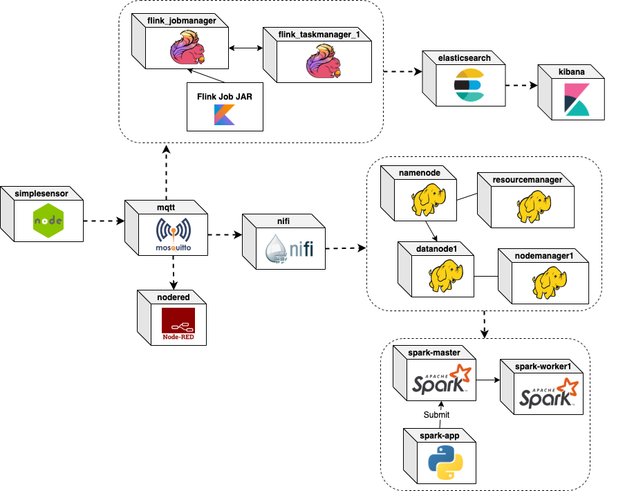

# Reasoning

This document describes the core ideas and components that can be used in order to reasong about IoT incidents in Big Data applications.

[TOC]

##High-Level Introduction

Given an everyday Big Data pipeline responsible for ingesting, processing (both real-time and batch) and storing data of high volume, variety, velocity and veracity, so-called *incidents* (as defined in [TruongCompsac18](https://users.aalto.fi/~truongh4/publications/2018/truong-compsac2018-cr.pdf)) are inevitable. Individual incidents may happen on various abstraction layers such as physical (hardware issues), infrastructure (Cloud, VM issues), software (application platform and user application), and at the same time from the perspective of the data such as the lack of crucial information, high redundancy, inaccuracy, bad timeliness and many more. Obviously there are a lot of factors involved and usually individual incidents are connected to each other, either directly or indirectly in a cause-and-effect relationship. The bigger and more complex the pipeline gets, the ability to find the root-cause of incidents and to efficiently reason about them becomes exponentially more difficult.

In this document we provide a potential strategy with concrete tools and implementation for tackling this challenge. Goals include general applicability, extensibility, adaptability and scalability. Our proposed solution is based solely on open-source tools and focuses on the independence of specific tools s.t. these can be exchanged with others.

## Reference Big Data Pipeline

From now on *pipeline* refers to the examplery Big Data pipeline which requires monitoring and detection of incidents. The image below shows the structure of the pipeline and the flow of data.



Next, we will describe the function of each pipeline component. **Important note**: beware, that most of these components must be deployed in a cluster consisting of multiple containers. The image above does not reflect the deployment view, it is merely an abstraction.

### Sensors

The emission of sensor data is simulated by a simple Node.js application, which reads each row of a dataset and publishes it to the `customTopic` topic of the MQTT broker.

#### Dataset

The dataset is called *GNFUV Unmanned Surface Vehicles Sensor Data Set 2 Data Set* and is available for free on the [UCI Machine Learning Repository](https://archive.ics.uci.edu/ml/datasets/GNFUV+Unmanned+Surface+Vehicles+Sensor+Data+Set+2). The data-set contains eight (2x4) data-sets of mobile sensor readings data (humidity, temperature) corresponding to a swarm of four Unmanned Surface Vehicles (USVs) in a test-bed, Athens, Greece.

The datasets have been adjusted so that only the attributes *device_id*, *humidity*, *temperature*, *time* are included. The simulated sensor sends records in a configurable time interval. The following shows a sample JSON encoded record that gets published to the MQTT broker:

```json
{
"device_id": "gnfuv-temp-exp1-55d487b85b-5g2xh",
"humidity": "21",
"temperature": "40",
"time": "2020-02-18T21:23:32.106Z"
}
```

For more information about implementation details, configuration and deployment please refer to the [Sensors Readme](pipeline/sensors/README.md).

### MQTT Broker

The MQTT broker is realized by a single [Mosquitto](https://mosquitto.org/) instance. It acts as a gateway between the sensor data coming from the oustide world and the other analytics components.

For more detailed information about configuration, deployment please refer to the [MQTT Broker Readme](pipeline/mqtt/README.md).

### Apache Flink

The Flink components represents a common stream-processing aggregation scenario. It consumes the sensor data from the MQTT broker, keys the stream by the `device_id` attritbute and calculates the averages of `humidity` and `temperature` for every 10 records. The resulting calculation is finally sent to the Elasticsearch component and stored under the `flink-sensor-data` index.

A sample JSON-encoded aggregation produced by Flink looks the following:

```json
{
    "id": "94778233-4024-4962-b398-dc179f144457",
    "deviceId": "gnfuv-temp-exp1-55d487b85b-5g2xh",
    "numberOfMeasurements": 10,
    "averageHumidity": 22,
    "averageTemperature": 39.5,
    "measurementIds": [
      "2020-01-15T10:59:09.549Z",
      "2020-01-15T10:59:10.615Z",
      "2020-01-15T10:59:11.618Z",
      "2020-01-15T10:59:12.620Z",
      "2020-01-15T10:59:13.623Z",
      "2020-01-15T10:59:14.626Z",
      "2020-01-15T10:59:15.631Z",
      "2020-01-15T10:59:16.633Z",
      "2020-01-15T10:59:17.637Z",
      "2020-01-15T10:59:18.641Z"
    ]
}
```

Note: the original dataset doesn't contain unique IDs for each recording. Since a report like this is in the scope of a single device, the timestamp of the record can be used as `measurementId`(more precisely, the pair of `deviceId` and `time` is always unique).

For more information about implementation details, configuration and deployment please refer to the [Flink Readme](pipeline/flink/README.md).

### Apache NiFi

The Nifi component has the responsibility to simply consume the sensor records from the MQTT broker and storing them in a remote HDFS (= the Hadoop component). There is an already pre-built [NiFi Template](pipeline/nifi/IoT_Sensor_Data_Storage_Template.xml) in XML-format, which can be imported in the web-UI. The template containes the extended version showcasing how application-level signals can be emitted.

For more information about implementation details, configuration and deployment please refer to the [NiFi Readme](pipeline/nifi/README.md).

### Node-RED

The [Node-RED](https://nodered.org/) component represents a Node.js-based event-driven data pipeline. The provided *Flow* for our scenario simply consumes the sensor records from the MQTT broker and writes them to its local filesystem. The purpose of this component is to have technological heterogeneity with regard to platforms and programming languages. 

### Apache Hadoop

As introduced earlier, the Hadoop cluster merely acts as a storage component in our scenario. The sensor data collected in a HDFS is later leveraged by Spark to perform data analysis.

For more information about configuration and deployment please refer to the [Hadoop Readme](pipeline/hadoop/README.md).

### Apache Spark

The [Apache Spark](https://spark.apache.org/) component represents a large-scale data analytics use-case. The application reads sensor records from the remote HDFS and performs a Kmeans clustering on them based on the `humidity` and `temperature` attributes. The results are simply printed out. Again, for the purposes of heterogeneity, the application code is written in Python.

For more information about implementation details, configuration and deployment please refer to the [Spark Readme](pipeline/spark/README.md).

### Elasticsearch and Kibana

Apart from their usual responsibilities, these two components are present in order to close the Big Data analytics circle. [Elasticsearch](https://www.elastic.co/elasticsearch) is used to store Flink's generated reports and, as we will see later, logs and important events. [Kibana](https://www.elastic.co/kibana) is the visualizing component of the Delivery phase.

### Minimum Deployment View (Docker)

The [docker-compose.yml](docker-compose.yml) file contains all the definitions of services/containers that are required in order to run the reference pipeline. Only the Elasticsearch and Kibana services are not defined in this file, because they are also part of the monitoring pipeline (their definitions can be found in  [docker-compose.monitoring.yml](docker-compose.monitoring.yml). Please note that some of the services are meant to be scaled horizontally. Below  a diagram is shown, containing the minimum amount of containers.



## Concepts and Terminology

### Pipeline Component

### Signal

### Composite Signal


## Monitoring & Reasoning Pipeline

### Pipeline at a glance

asd

### Log Collection: Fluentd 

asd

### Metric Collection and Alerting: Prometheus 

asd

### Reliable Signal Collector: Kafka Pub/Sub 

asd

### Prometheus->Kafka Bridge: Ingestion-Service by Nest.js 

asd

### Scalable Signal Reasoning: Flink Reasoner 

asd

### Dynamic Incident and Signal Knowledge Graph: Neo4j 

asd

### Long-term Storage of Recorded Signals: Cassandra 

blabla

### Frequent-Pattern Mining: Spark MLlib 

asd

### Minimum Deployment View (Docker)


